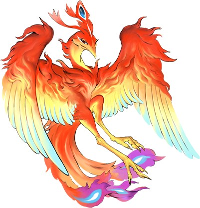

### suzaku

Golang聊天服务端



### 开发环境

```
OS: Mac OS X 10.15.7
Golang: 1.17.10
MySQL: 8.0.29
MongoDB: 5.0.9
Redis: 6.2.7
Java: 1.8.0_265
Zookeeper: 3.6.3
Kafka: 3.1.0
ElasticSearch: 8.1.3
MinIO: RELEASE.2022-04-16T04-26-02Z
ETCD: 3.5.2
gRpc: 1.45.0
Docker Client/Server: 20.10.12
Docker-Compose: 1.29.2
```